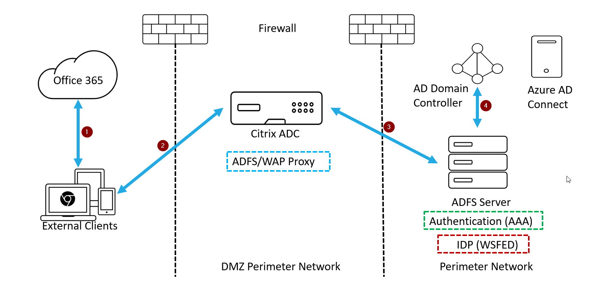
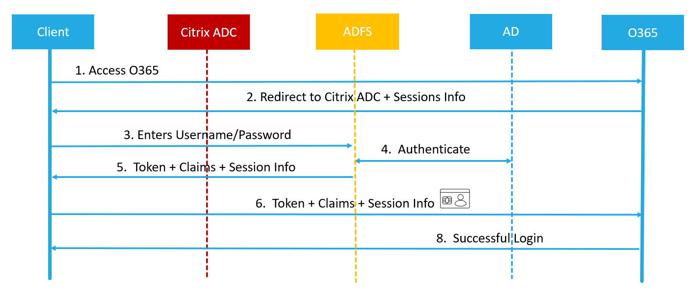
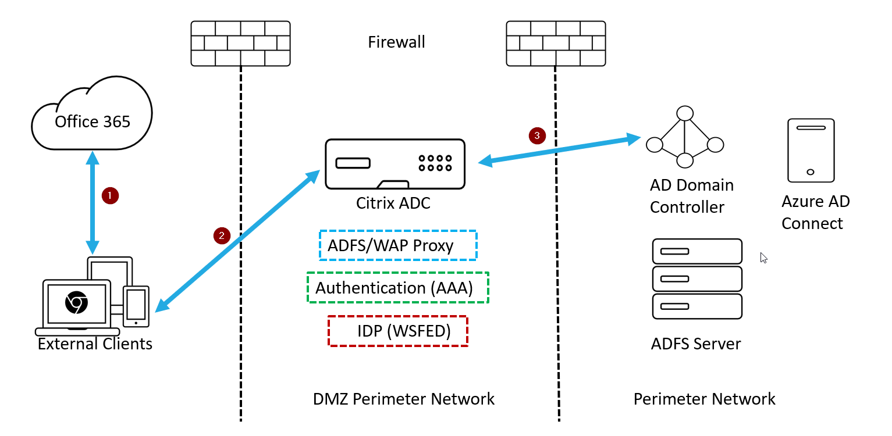
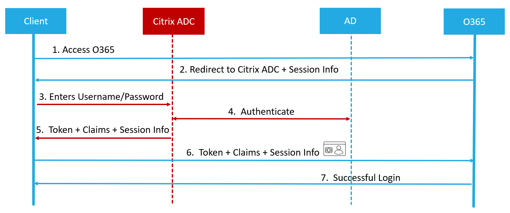
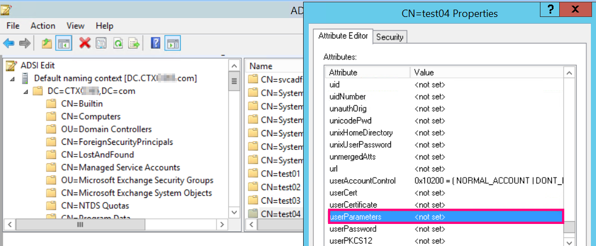

# O365 Hybrid Deployment, Single Sign On (SSO), Multi Factor Authentication (Native OTP) with Citrix ADC (NetScaler)

>This guide focuses on O365 hybrid deployment usecases and defining the process for deployment ,Enabling Single Sign On (SSO) into Microsoft Office 365 with Citrix ADC (NetScaler).

## Contents

| Section | Description |
| ------- | ----------- |
| [Section A](#section-a) | Introduction |
| [Section B](#section-b) | O365 Hybrid Deployment with Citrix ADC Use cases |
| [Section C](#section-c) | Configuration Details |
| [Section D](#section-d) | Solution Description |

## Section A

## Introduction

Citrix ADC formerly known as NetScaler is a world-class product with the proven ability to load balance, accelerate, optimize, and secure enterprise applications.

Microsoft Office 365 is a suite of cloud-based productivity and
collaboration applications provided by Microsoft on a subscription
basis. It includes Microsoft’s popular server-based applications such as Exchange, SharePoint, Office and Skype for Business. The apps are widely used by SMBs and enterprise customers alike to enable their business without significant capital investments.

---

## Section B

## O365 Hybrid Deployment with Citrix ADC Use cases

|S.No | Use Case Description| ADFS/Reverse Proxy | Authentication | IDP ( Token Generator)|
| ------- | ------- | ---------- | -------- | ------------------ |
| 1 | Citrix ADC as ADFS Proxy and ADFS as IDP | Citrix ADC | ADFS | ADFS |
| 2 | Citrix ADC as ADFS Proxy, Authentication and WSFED IDP  | Citrix ADC | Citrix ADC | Citrix ADC |

## Use Case wise Features

|S.No | Features | Use Case 1 : Citrix ADC as ADFS proxy  | Use Case 2:Citrix ADC as ADFS proxy + Authentication + IDP |
| ------- | -------  | ------------ | --------------- |
|1 | Load balancing | Yes |  Yes |
|2 | SSL Termination | Yes | Yes |
|3 | Rate Limiting | Yes  |Yes |
|4 | Consolidation (Reduces DMZ server foot print and Saves Public IP) | Yes |Yes |
|5 | Web Application Firewall (WAF) | Yes  |Yes |
|6 | Authentication Offload to Citrix ADC | No  |Yes (Active* and Passive* Clients) |
|7 | SSO (Single Sign On) | No  |Yes  (Active* and Passive* Clients) |
|8 | MFA (Multi Factor Authentication) | No  |Yes  (Active* and Passive* Clients)|
|9 | Can I avoid ADFS Server Farm ? | No  | Yes |

`*Passive Clients are browser based clients like Google chrome, Mozilla firefox, Internet explorer (edge)`

`*Active Clients are Microsoft native Clients like Outlook,SFB and Microsoft Office clients (Word,PowerPoint,Excel,OneNote)`

---

## Section C

## Configuration Details

The table below lists the minimum required software version for this integration to work successfully. The integration process should also work with higher versions of the same.

| Product | Minimum Required version | License | Use Case
| ------- | ----------- | ----------| ----------|
| Citrix ADC (NetScaler) | 12.1  | Standard | Citrix ADC as ADFS Proxy and ADFS as IDP |
Citrix ADC (NetScaler) | 12.1  | Enterprise/Premium | Citrix ADC as ADFS Proxy, Authentication and WSFED IDP |

## Citrix ADC features to be enabled

The essential Citrix ADC feature that needs to be enabled is explained below.

* Load balancing : Basic Load Balancing, enables load balancing of multiple Exchange Servers

* Content switching : Content Switching, enables single-IP access and redirection of queries to the correct load balancing virtual servers

* Rewrite : For redirecting users to secure pages

* SSL offload : For offloading SSL processing to the NetScaler, therefore reducing the load on the
Exchange server.
  
* AAA-TM (Authentication, Authorization and Auditing - Traffic Management) : The AAA feature set controls Citrix ADC authentication, authorization, and auditing policies.These policies include definition and management of various authentication schemas.
Citrix ADC supports a wide range of authentication protocols and a strong, policy-driven application firewall capability.

---

## Section D

## Solution Description

Enabling SSO for Office 365 with Citrix ADC consists of two parts – configuring the Office 365 portal and the Citrix ADC appliance. Office 365 should be configured to use Citrix ADC (NetScaler) as a third party SAML IDP (Identity Provider). The Citrix ADC is configured as a SAML IDP by creating the AAA Virtual Server that will host the SAML IDP policy.

The following instructions assume that you have already created the appropriate external and/or internal DNS entries to route authentication requests to a Citrix ADC-monitored IP address, and
that an SSL certificate has already been created and installed on the appliance for the SSL/HTTPS communication. This document also assumesthat a Microsoft Office 365 account has been created, the relevant domain has been added and domain verification for the same has been completed.

## Use Case 1 Solution : Citrix ADC as ADFS Proxy and ADFS as IDP

### Deployment Topology



1. Client login to login.microsoftonline.com for Office 365 access and gets redirected to Citrix ADC.
1. User enters his/her credentials (UserName/Password) which are passed to ADFS Server
1. ADFS Server authenticates the credentials with On-premises Active Directory of the domain.
1. ADFS server up on successful validation with Active directory generates a token which will passed to Office 365 for access.

### Traffic Flow Diagaram



> `Prerequisites`

* Citrix ADC (NetScaler)
* Domain ADFS Server IP
* Domain SSL Certificate
* Free VIP for Content Switching Virtual Server

> `Deployment Steps`

1. `ADFS Service`: We will create ADFS service on Citrix ADC for ADFS server with SNI enabled

    >Domain ADFS Server IP (1.1.1.1) is required to add ADFS as service

    ```cli
    Syntax:
    add service <Domain_ADFS_Service> <ADFS Server IP> SSL 443 -gslb NONE -maxClient 0 -maxReq 0 -cip DISABLED -usip NO -useproxyport YES -sp OFF -cltTimeout 180 -svrTimeout 360 -CKA NO -TCPB NO -CMP NO

    Example:
    add service CTXTEST_ADFS_Service 1.1.1.1 SSL 443 -gslb NONE -maxClient 0 -maxReq 0 -cip DISABLED -usip NO -useproxyport YES -sp OFF -cltTimeout 180 -svrTimeout 360 -CKA NO -TCPB NO -CMP NO
    ```

    >FQDN or Domain commonname for content switching virtual server (sts.domain.com) is required to enable SNI on above ADFS Service

    ```cli
    Syntax:
    set ssl service <Domain_ADFS_Service> -SNIEnable ENABLED -commonName <sts.domain.com>

    Example:
    set ssl service CTXTEST_ADFS_Service -SNIEnable ENABLED -commonName sts.ctxtest.com
    ```

2. `ADFS Load Balancing Vserver` : We will create non-addressable secure Load balancing virtual server for ADFS service

    >Domain SSL certificate (SSL_CERT) is required for Secure traffic.

    ```cli
    Syntax:
    add lb vserver <Domain_ADFS_LBVS> SSL 0.0.0.0 0 -persistenceType NONE -cltTimeout 180
    Example:
    add lb vserver CTXTEST_ADFS_LBVS SSL 0.0.0.0 0 -persistenceType NONE -cltTimeout 180

    Syntax:
    bind lb vserver <Domain_ADFS_LBVS> <Domain_ADFS_Service>
    Example:
    bind lb vserver CTXTEST_ADFS_LBVS CTXTEST_ADFS_Service

    Syntax:
    bind ssl vserver <Domain_ADFS_LBVS> -certkeyName <SSL_CERT>
    Example:
    bind ssl vserver CTXTEST_ADFS_LBVS -certkeyName ctxtest_newcert_2019
    ```

3. `Content Switching Vserver for Domain` : We will create a content wsitching virtual server for domian which will be front ending all the traffic of reverse proxy(adfs proxy), authentication and identity provider (IDP).

    >NOTE: One free VIP (2.2.2.2) which is natted to Public IP is required for content switching virtual server so that it is reachable for both external and internal traffic  

    ```cli
    Syntax:
    add cs vserver <Domain_CSVS> SSL <FREE VIP> 443 -cltTimeout 180 -persistenceType NONE
    Example:
    add cs vserver CTXTEST_CSVS SSL 2.2.2.2 443 -cltTimeout 180 -persistenceType NONE

    Syntax:
    bind cs vserver <Domain_CSVS> -lbvserver <Domain_ADFS_LBVS>
    Example:
    bind cs vserver CTXTEST_CSVS -lbvserver CTXTEST_ADFS_LBVS
    set ssl vserver CTXTEST_CSVS -sessReuse DISABLED

    Syntax:
    bind ssl vserver <Domain_CSVS> -certkeyName <SSL_CERT>
    Example:
    bind ssl vserver CTXTEST_CSVS -certkeyName ctxtest_newcert_2019
    ```

## Use Case 2 Solution: Citrix ADC as ADFS Proxy, Authentication and WSFED/SAML IDP

### Deployment Topology



1. Client login to login.microsoftonline.com for Office 365 access and gets redirected to Citrix ADC.
1. User enters his/her credentials (Username/Password/OTP) for Multi-Factor Authentication
1. Citrix ADC validates the credentials with Active Directory and generates a token natively on Citrix ADC which are passed to Office 365 for access.

>In addition to above the same authentication can be used for Microsoft and Non-Microsoft applications for SSO (Single Sign On)

### Traffic Flow Diagaram



> `Prerequisites`

* use case 1 deployment steps
* Active Directory
* Domain SSL Certificate
* Citrix ADC SSL certificate and ADFS token signing certificate on ADFS server should be same

> `Deployment Steps`

1. `LDAP Authentication` : For domain users to be able to log on to the Citrix ADC appliance by using their corporate email addresses, you must configure an LDAP authentication server and policy on the appliance and bind it to your AAA VIP address. (Use of an existing LDAP configuration is also supported)

    We will create LDAP action and policy for LDAP Authentication,which we will bind to Authentication (AAA) virtual server in later stage.

    >Active Directory IP (3.3.3.3), Administrator account credentials, Domain Controller details are required

    ```cli
    Syntax:
    add authentication ldapAction <Domain_LDAP_Action> -serverIP <Active Directory IP> -serverPort 636 -ldapBase "cn=Users,dc=domain,dc=com" -ldapBindDn "cn=administrator,cn=Users,dc=domain,dc=com" -ldapBindDnPassword <administrator password> -encrypted -encryptmethod ENCMTHD_3 -ldapLoginName sAMAccountName -groupAttrName memberOf -subAttributeName cn -secType SSL -ssoNameAttribute UserPrincipalName -followReferrals ON -Attribute1 mail -Attribute2 objectGUID

    Example:
    add authentication ldapAction CTXTEST_LDAP_Action -serverIP 3.3.3.3 -serverPort 636 -ldapBase "cn=Users,dc=ctxtest,dc=com" -ldapBindDn "cn=administrator,cn=Users,dc=ctxtest,dc=com" -ldapBindDnPassword xxxxxxxxxxx -encrypted -encryptmethod ENCMTHD_3 -ldapLoginName sAMAccountName -groupAttrName memberOf -subAttributeName cn -secType SSL -ssoNameAttribute UserPrincipalName -followReferrals ON -Attribute1 mail -Attribute2 objectGUID

    Syntax:
    add authentication Policy <Domain_LDAP_Policy> -rule true -action <Domain_LDAP_Action>

    Example:
    add authentication Policy CTXTEST_LDAP_Policy -rule true -action CTXTEST_LDAP_Action
    ```

2. `Citrix ADC as WSFED IDP/SAML IDP` : For your users to receive the WSFED/SAML token for logging on to Microsoft Office 365, you must configure a WSFED IDP/SAML IDP policy and profile, and bind them to the AAA virtual server where users’ credentials are sent.

    We will create WSFED IDP/SAML IDP action and policy for token genaeration ,which we will bind to Authentication (AAA) virtual server in later stage.

    >Get Issuer Name for your Office 365 in domain ADFS server through powershell command

    ```cli
    Syntax:
    add authentication samlIdPProfile <Domain_SAMLIDP_Profile> -samlIdPCertName <SSL_CERT> -assertionConsumerServiceURL "https://login.microsoftonline.com/login.srf" -samlIssuerName <Issuer Name for Office 365 in ADFS Server> -rejectUnsignedRequests OFF -audience urn:federation:MicrosoftOnline -NameIDFormat persistent -NameIDExpr "HTTP.REQ.USER.ATTRIBUTE(2).B64ENCODE" -Attribute1 IDPEmail -Attribute1Expr "HTTP.REQ.USER.ATTRIBUTE(1)"

    Example:
    add authentication samlIdPProfile CTXTEST_SAMLIDP_Profile -samlIdPCertName ctxtest_newcert_2019 -assertionConsumerServiceURL "https://login.microsoftonline.com/login.srf" -samlIssuerName "http://ctxtest.com/adfs/services/trust/" -rejectUnsignedRequests OFF -audience urn:federation:MicrosoftOnline -NameIDFormat persistent -NameIDExpr "HTTP.REQ.USER.ATTRIBUTE(2).B64ENCODE" -Attribute1 IDPEmail -Attribute1Expr "HTTP.REQ.USER.ATTRIBUTE(1)"

    Syntax:
    add authentication samlIdPPolicy <Domain_SAMLIDP_Policy> -rule "HTTP.REQ.HEADER(\"referer\").CONTAINS(\"microsoft\") || true" -action <Domain_SAMLIDP_Profile>

    Example:
    add authentication samlIdPPolicy CTXTEST_SAMLIDP_Policy -rule "HTTP.REQ.HEADER(\"referer\").CONTAINS(\"microsoft\") || true" -action CTXTEST_SAMLIDP_Profile
    ```

3. `AAA Vserver` : An employee trying to log in to Office 365 is redirected to a Citrix ADC AAA virtual server which validates the employee’s corporate credentials. This virtual server listens on port 443, which requires an SSL certificate and it is a non-addressable IP which will be bound to addressable content switching virtual server.

    ```cli
    Syntax:
    add authentication vserver <Domain_AAA_VS> SSL 0.0.0.0
    Example:
    add authentication vserver CTXTEST_AAA_VS SSL 0.0.0.0

    bind authentication vserver CTXTEST_AAA_VS -portaltheme RfWebUI

    Syntax:
    bind authentication vserver <Domain_AAA_VS> -policy <Domain_SAMLIDP_Policy> -priority 100 -gotoPriorityExpression NEXT
    Example:
    bind authentication vserver CTXTEST_AAA_VS -policy CTXTEST_SAMLIDP_Policy -priority 100 -gotoPriorityExpression NEXT

    Syntax:
    bind authentication vserver <Domain_AAA_VS> -policy <Domain_LDAP_Policy> -priority 100 -gotoPriorityExpression NEXT
    Example:
    bind authentication vserver CTXTEST_AAA_VS -policy CTXTEST_LDAP_Policy -priority 100 -gotoPriorityExpression NEXT

    bind ssl vserver CTXTEST_AAA_VS -certkeyName ctxtest_newcert_2019

    Syntax:
    add cs action <Domain_CS_Action> -targetVserver <Domain_AAA_VS>
    Example
    add cs action CTXTEST_CS_Action -targetVserver CTXTEST_AAA_VS
    ```

    >Get Active Logon URI, Passive Logon URI for your Office 365 in domain ADFS server through powershell command. Mostly this policy will remains same for majority of the Office 365 hybrid deployments but it is always better to do cross check.

    ```cli
    Syntax:
    add cs policy <Domain_CS_Policy> -rule "is_vpn_url || http.req.url.contains(\"/adfs/ls\") || http.req.url.contains(\"/adfs/services/trust\") || http.req.url.contains(\"/manageotp\") " -action <Domain_CS_Action>

    Example:
    add cs policy CTXTEST_CS_Policy -rule "is_vpn_url || http.req.url.contains(\"/adfs/ls\") || http.req.url.contains(\"/adfs/services/trust\") || http.req.url.contains(\"/manageotp\") " -action CTXTEST_CS_Action

    bind cs vserver CTXTEST_CSVS -policyName CTXTEST_CS_Policy -priority 100
    ```

4. `Citrix ADC Native OTP as dual factor authentication`:
Native One Time Password (OTP) solution is introduced with Citrix ADC 12.0 Build 51.24. This feature offers OTP solution without having to use a third party server, thus greatly reducing CapEx and OpEx for customers. In addition, it consolidates configuration at Citrix ADC thus offering great control to administrators.

    Registration is required only once per unique device, and typically is restricted to certain environments. Once registration is complete, validation of OTP is as simple as configuring an additional authentication policy.

    Since Citrix ADC OTP obviates the need for third party servers, Citrix ADC Gateway has the additional responsibility of offering an interface to manage user devices, along with being able to validate those devices.

    We will configure Citrix ADC for Dual Authentication (LDAP + OTP) as well as Registration for First time users.Device registartion URL can be accessed internally for better security.

    > `Prerequisites`

    * Active Directory
        * Supported versions are 2016, 2012 and 2008 Active Directory domain function level
        * The Citrix ADC ldapBind username attribute needs to have write access to the user’s AD path
        * Citrix ADC support a logon and registration rate of 300 devices per minute for a single AD server.
        * The attribute we will use in this deployment will be ‘UserParameters’. As this is an existing attribute within the AD user, we do not need to make any changes to AD itself. However, we have to make sure that the attribute is not being used for any other purpose.

            To check this, go to ‘ADSI > select user > right click on it > scroll down to attribute list”. You shall see ‘not set’ within the attribute like this:

            

    * TOTP Client
  
        * Citrix ADC supports RFC6238 TOTP generation i.e., any TOTP client which complies with RFC 6238 TOTP generation will be supported <https://tools.ietf.org/html/rfc6238>
        * TOTP supported length is 6
        * Tested client (Android and Apple): Citrix SSO, Google Authenticator

    * Time Sync
        * Both Citrix ADC and user’s device have to be in-sync
        * It is recommended that both entities are synced to a common Network Time Server
  

    Citrix ADC Configuration:

    * `LDAP Authentication for OTP` : We will create a separate LDAP action and policy for LDAP Authentication for OTP factor ,which we will bind to Authentication (AAA) virtual server in later stage.

        >Active Directory IP (3.3.3.3), Administrator account credentials, Domain Controller details are required

        ```cli
        Syntax:
        add authentication ldapAction <Domain_OTP_LDAP_Action> -serverIP <Active Directory IP> -serverPort 636 -ldapBase "cn=Users,dc=domain,dc=com" -ldapBindDn "cn=administrator,cn=Users,dc=domain,dc=com" -ldapBindDnPassword <administrator password> -encrypted -encryptmethod ENCMTHD_3 -ldapLoginName samaccountname -secType SSL -authentication DISABLED -OTPSecret userParameters

        Example:
        add authentication ldapAction CTXTEST_OTP_LDAP_Action -serverIP 3.3.3.3 -serverPort 636 -ldapBase "cn=Users,dc=ctxtest,dc=com" -ldapBindDn "cn=administrator,cn=Users,dc=ctxtest,dc=com" -ldapBindDnPassword xxxxxxxxxxx -encrypted -encryptmethod ENCMTHD_3 -ldapLoginName samaccountname -secType SSL -authentication DISABLED -OTPSecret userParameters

        Syntax:
        add authentication Policy <Domain_OTP_LDAP_Policy> -rule true -action <Domain_OTP_LDAP_Action>

        Example:
        add authentication Policy CTXTEST_OTP_LDAP_Policy -rule true -action CTXTEST_OTP_LDAP_Action
        ```

    * `Login Schema`: We need to show username, password and “passcode or device name” field with checkbox to users when they logon

        We will create two login schemas

        * Single_manage: This schema is for validation of LDAP credentials and for registartion of new OTP geneartion device .In this case Android/Iphone with Citrix SSO or Google Authenticator applications installed on it. We assumed that the internal client IPs are in 10.0.0.0/8 subnet. Device Registartion URL Example: <https://sts.ctxtest.com/manageotp> for registartion of devices.

            ```cli

            add authentication loginSchema single_manage -authenticationSchema "LoginSchema/SingleAuthManageOTP.xml"
            add authentication loginSchemaPolicy single_manage -rule "HTTP.REQ.COOKIE.VALUE("NSC_TASS").EQ("manageotp")&&client.ip.src.in_subnet(10.0.0.0/8)" -action single_manage

            Syntax:
            bind authentication vserver <Domain_AAA_VS> -policy single_manage -priority 1 -gotoPriorityExpression END
            Example:
            bind authentication vserver CTXTEST_AAA_VS -policy single_manage -priority 1 -gotoPriorityExpression END
            ```

        * Dual_Auth: This schema is for dual factor which has fields for both User credentials and OTP passcode.

            ```cli
            add authentication loginSchema dual_auth -authenticationSchema "LoginSchema/DualAuth.xml"
            add authentication loginSchemaPolicy dual_auth -rule true -action dual_auth

            Syntax:
            bind authentication vserver <Domain_AAA_VS> -policy dual_auth -priority 5 -gotoPriorityExpression END
            Example:
            bind authentication vserver CTXTEST_AAA_VS -policy dual_auth -priority 5 -gotoPriorityExpression END
            ```

        Bind above login schemas and otp as second factor to AAA virtual server for login

        ```cli
        add authentication loginSchema otp_factor_schema -authenticationSchema noschema
        add authentication policylabel otp_factor -loginSchema otp_factor_schema

        Syntax:
        bind authentication policylabel otp_factor -policyName <Domain_OTP_LDAP_Policy> -priority 100 -gotoPriorityExpression NEXT
        Example:
        bind authentication policylabel otp_factor -policyName CTXTEST_OTP_LDAP_Policy -priority 100 -gotoPriorityExpression NEXT

        Syntax:
        bind authentication vserver <Domain_AAA_VS> -policy <Domain_LDAP_Policy> -priority 100 -nextFactor otp_factor -gotoPriorityExpression NEXT
        Example:
        bind authentication vserver CTXTEST_AAA_VS -policy CTXTEST_LDAP_Policy -priority 100 -nextFactor otp_factor -gotoPriorityExpression NEXT

        ```

---
